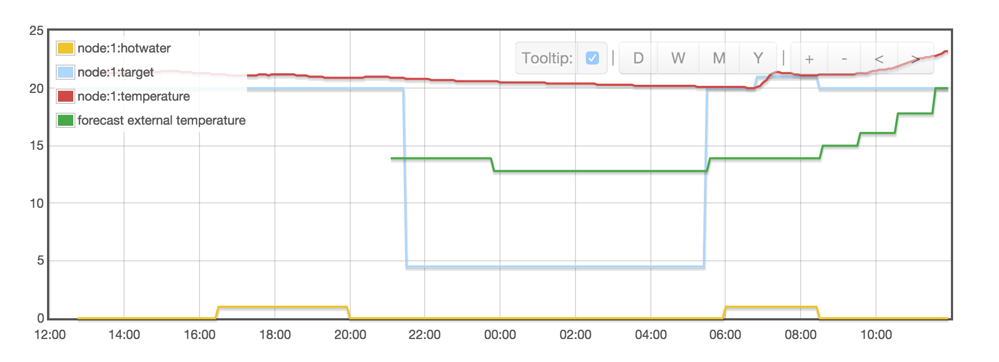

### Hive to EMON CMS data push

Extract the following data from the [Hive][1] thermostat

* Target temperature
* Current temperature
* Boiler status
* External forecast temperature

And post into a matching ``node'' within [emoncms][2], from there you can use as part of any home metric dashboard e.g.:

[1]:  https://www.hivehome.com
[2]:  http://emoncms.org/
